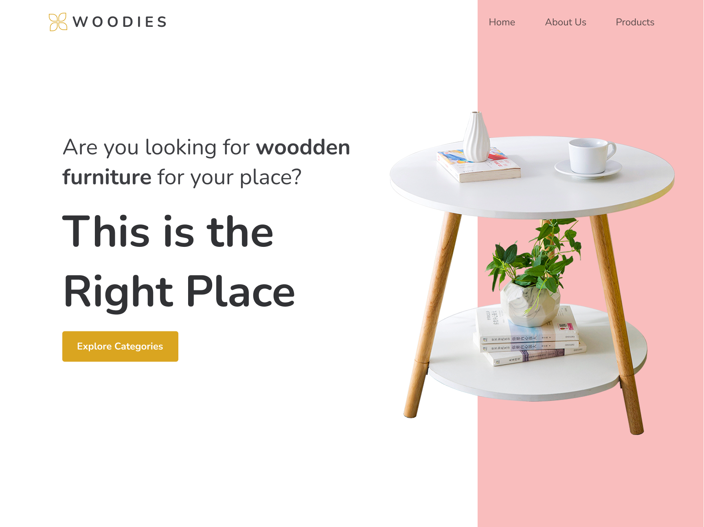
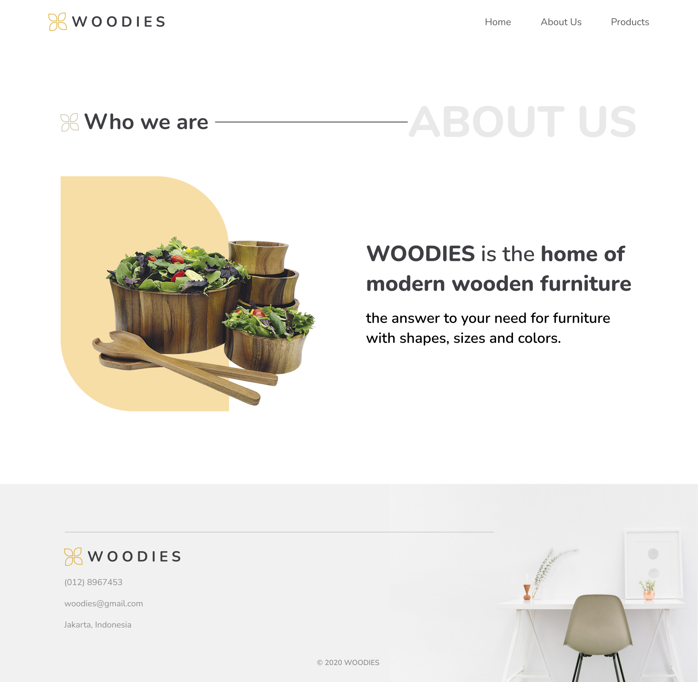

# React TS  Website - Woodies

Project Overview

React Woodies is a modern, responsive web application built with React, designed to deliver a seamless user experience for [specific purpose, e.g., portfolio showcasing, e-commerce, or content management; please clarify for precision]. The project leverages contemporary front-end technologies to provide an intuitive interface and efficient performance, suitable for [intended use case, e.g., personal use, small businesses, or creative projects].

Technologies Used

React: JavaScript library for building dynamic user interfaces.

HTML5 & CSS3: For structuring and styling the application.

JavaScript (ES6+): For client-side logic and interactivity.

GitHub Pages: For hosting the demo deployment.

Node.js & npm: For managing dependencies and build processes.

Features

Responsive design compatible with desktop and mobile devices.

Modular React components for maintainability and scalability.

Optimized performance for fast loading and smooth interactions.

[Add specific features, e.g., user authentication, dynamic content rendering, if applicable].
